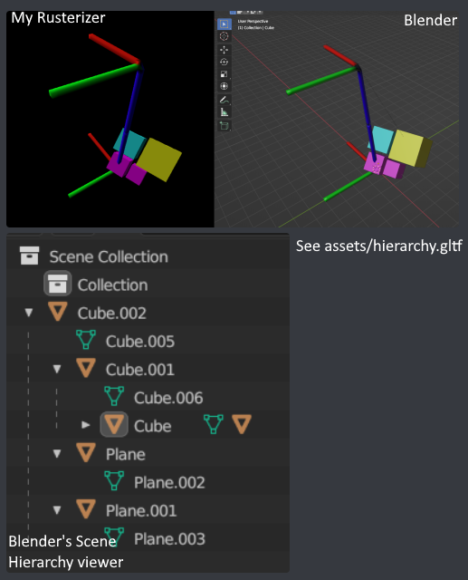
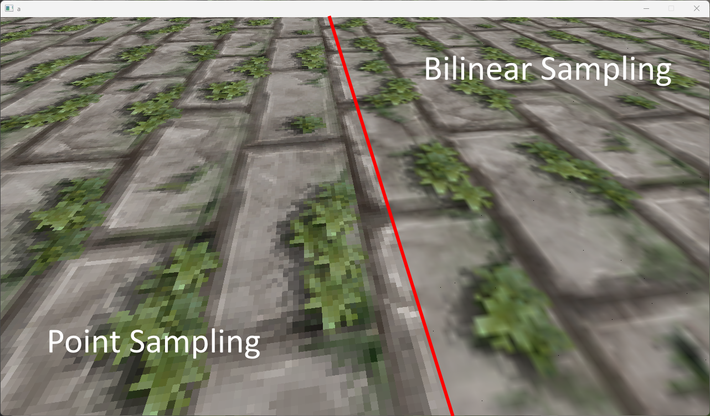
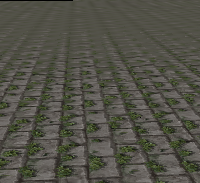
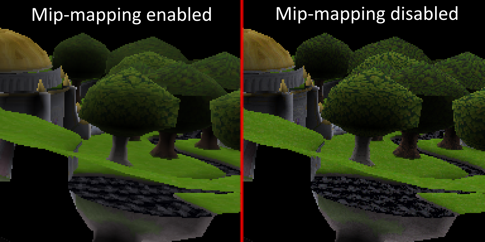

# Title
Name: Lily Haverlag

BUas email: 200831@buas.nl

## Features
+ Texture mapping (with perspective correction, bilinear filtering, multiple wrapping modes, and mip-mapping)
+ Full glTF hierarchy parsing (with correct local transforms)
+ glTF loading
+ Debug camera
+ 3D transformations

## Showcase
### glTF scene hierarchy

### Texture mapping modes

### Mip-mapping

